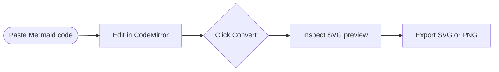

# Mermaid Tool

一个基于 React、TypeScript 和 Vite 构建的 Mermaid 图表编辑与预览工具。项目在浏览器端完成 Mermaid 代码编辑、渲染预览和图片导出，适合快速编写流程图、时序图、类图、状态图等 Mermaid 支持的图表。

## 功能特性

- Mermaid 代码编辑：集成 CodeMirror 6，支持基础编辑能力、缩进和 Mermaid 语法高亮。
- 一键渲染预览：点击 `Convert` 后在右侧生成 SVG 图表预览。
- SVG / PNG 导出：支持将当前图表下载为 `diagram.svg` 或 `diagram.png`。
- 预览缩放与拖拽：按住 Shift 滚动鼠标滚轮缩放图表，放大后可拖拽查看细节。
- 面板最大化：编辑区和预览区均可单独最大化，方便专注编辑或查看图表。
- 明暗主题切换：内置 Dark / Light 主题。
- 客户端安全处理：使用 Mermaid `securityLevel: strict` 渲染，并通过 DOMPurify 清理生成的 SVG。

## 技术栈

- React 18
- TypeScript
- Vite
- Mermaid
- CodeMirror 6
- DOMPurify

## 快速开始

### 环境要求

建议使用 Node.js 18 或更高版本。

### 安装依赖

```bash
npm install
```

### 启动开发服务

```bash
npm run dev
```

启动后根据终端输出访问本地地址，通常为：

```text
http://localhost:5173
```

### Windows 一键启动

在 Windows 中也可以直接双击根目录的 `run-dev.bat`。脚本会自动进入项目目录，缺少 `node_modules` 时先安装依赖，然后启动 Vite 开发服务。

### 构建生产版本

```bash
npm run build
```

构建产物会输出到 `dist/` 目录。

### 本地预览生产构建

```bash
npm run preview
```

## 使用说明

1. 在左侧 `Editor` 面板中输入或粘贴 Mermaid 代码。
2. 点击中间的 `Convert` 按钮生成图表。
3. 在右侧 `Preview` 面板查看渲染结果。
4. 按住 Shift 滚动鼠标滚轮缩放预览，放大后拖拽图表查看局部内容。
5. 点击 `SVG` 或 `PNG` 导出图表文件。
6. 点击 `Dark` / `Light` 切换主题。

示例 Mermaid 代码：



## 项目结构

```text
.
├── index.html
├── package.json
├── vite.config.ts
├── src
│   ├── App.tsx
│   ├── main.tsx
│   ├── components
│   │   ├── CenterBar.tsx
│   │   ├── EditorPanel.tsx
│   │   ├── Header.tsx
│   │   ├── PreviewPanel.tsx
│   │   └── StatusBar.tsx
│   ├── editor
│   │   └── mermaidLanguage.ts
│   ├── hooks
│   │   ├── useMermaid.ts
│   │   └── useTheme.tsx
│   ├── lib
│   │   └── download.ts
│   └── styles
│       ├── global.css
│       └── tokens.css
└── public
```

## 核心模块说明

- `src/App.tsx`：应用主布局，维护 Mermaid 代码和面板最大化状态。
- `src/components/EditorPanel.tsx`：CodeMirror 编辑器封装。
- `src/components/PreviewPanel.tsx`：图表预览、缩放拖拽和导出入口。
- `src/hooks/useMermaid.ts`：Mermaid 动态加载、解析、渲染和 SVG 清理逻辑。
- `src/hooks/useTheme.tsx`：明暗主题状态管理。
- `src/lib/download.ts`：SVG 文本下载和 SVG 转 PNG 下载工具。

## 可用脚本

| 命令 | 说明 |
| --- | --- |
| `run-dev.bat` | Windows 双击启动开发服务，必要时自动安装依赖 |
| `npm run dev` | 启动 Vite 开发服务 |
| `npm run build` | 执行 TypeScript 构建并打包生产版本 |
| `npm run preview` | 预览生产构建产物 |

## 备注

- Mermaid 渲染在浏览器端完成，项目不会将图表代码上传到服务器。
- PNG 导出会通过浏览器 Canvas 将 SVG 绘制为图片，导出背景为白色。
- Mermaid 语法错误会显示在底部状态栏和预览区域中，便于定位问题。
